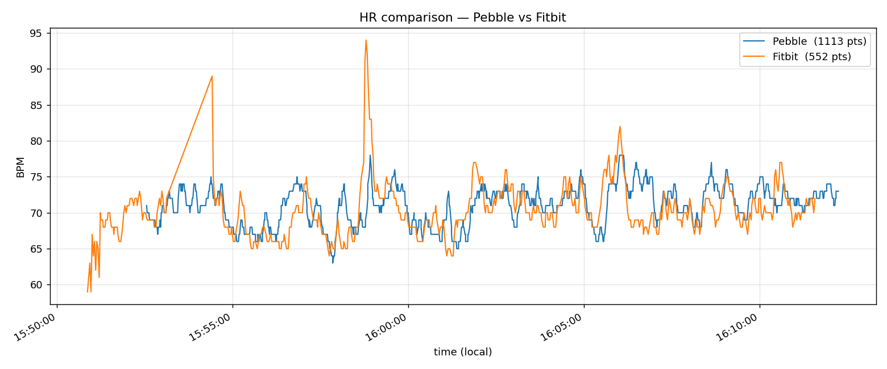

# HR comparison: Pebble vs Fitbit

Self-contained experiment that captures a time-synced heart-rate trace from
the Glance watchface (Pebble Time 2) and a Fitbit worn on the other wrist,
then plots them overlaid on a single time axis. Built to answer "how does
Pebble's 1Hz raw HR readout compare against a modern wrist-worn HRM in
practice?"

The whole experiment is gated behind a single `#define` in `src/c/main.c`
(`HR_COMPARE_LOG_ENABLED`) — flip it to `0` to silence, delete the two
marked blocks plus this directory to remove it entirely.

## TL;DR

```sh
# one-time setup
cd experiments/hr-compare
python3 -m venv .venv && source .venv/bin/activate
pip install -r requirements.txt
python3 fetch_fitbit.py --bootstrap

# each session
./scripts/pebble-logs-loop 127.0.0.1   # in another terminal
# … wear both devices, optionally start a Fitbit workout …
# … when done, Ctrl-C the loop …
python3 parse_pebble_log.py --log /tmp/pebble.log --out pebble.csv
python3 fetch_fitbit.py     --date 2026-05-12        --out fitbit.csv
python3 plot.py             --start 15:50 --end 16:15   # writes compare.png
```

A reference run lives in [`example/`](example/) — see
[example/compare.png](example/compare.png).

## Why this exists

The Pebble Time 2 firmware has two distinct HR metrics exposed through the
public C SDK:

- `HealthMetricHeartRateBPM` — "filtered, at most 15 minutes old" (per the
  SDK header). What the official tutorial uses.
- `HealthMetricHeartRateRawBPM` — the most-recent raw sample. What the
  built-in Pebble OS heart-rate screen uses, paired with
  `health_service_set_heart_rate_sample_period(1)`.

The Glance watchface reads `HealthMetricHeartRateRawBPM` at 1 Hz so the
displayed BPM moves nearly every second. The natural follow-up question is
how trustworthy that fast-but-raw value actually is — hence this experiment.
By default the Pebble side logs **both** the raw value (what the watch
shows) and the filtered value (what the SDK tutorial would have shown),
plus the Fitbit's data, on a shared axis.

## Architecture

```
                            ┌────────────────────┐
   Pebble Time 2 (emery)    │  watch HRM @ 1Hz   │
   running Glance           │  health_service_…  │
                            └──────────┬─────────┘
                                       │ HealthEventHeartRateUpdate
                                       ▼
                            ┌────────────────────┐
                            │ update_heart_rate()│  ── HRCMP <ts> <raw> <filt>
                            │ (src/c/main.c)     │     via APP_LOG
                            └──────────┬─────────┘
                                       │ BT
                                       ▼
   Phone (Pebble companion app, Dev Connection enabled)
                                       │ TCP :9000
                                       ▼ (adb forward tcp:9000)
   Host / laptop                       │
                                       ▼
              docker run rebble/pebble-sdk pebble logs ──▶ /tmp/pebble.log
                          (via scripts/pebble-logs-loop, auto-reconnects)

   Fitbit Charge 6 (or any Fitbit)
                                       │ BT
                                       ▼
                            Fitbit phone app  ── syncs ──▶  Fitbit cloud
                                                                    │
                                                                    ▼
                            Google Health API (health.googleapis.com)
                                                                    │
                                                            fetch_fitbit.py
                                                                    │
                                                                    ▼
                                                               fitbit.csv
```

The Pebble watchapp itself is unchanged for the experiment except for a
single extra `APP_LOG` call inside `update_heart_rate()`, gated by
`HR_COMPARE_LOG_ENABLED`. No new resources, no extra AppMessage paths.

## What the Pebble side logs

Each HR sample with `raw > 0` emits one log line:

```
HRCMP <unix_ts> <raw_bpm> <filtered_bpm>
```

- `unix_ts` — `time(NULL)` on the watch (Pebble syncs its clock via the
  phone, so this is wall-clock accurate to ~1s).
- `raw_bpm` — the value being shown on the watchface.
- `filtered_bpm` — `0` if the firmware doesn't yet have a valid filtered
  value (the parser treats `0` as missing).

Multiple events per second are normal — the Pebble health subsystem fires
`HealthEventHeartRateUpdate` on more than one tick per second sometimes.
The parser dedupes consecutive identical rows.

## Setup

### Step 1 — Google Health API (one-time, ~10 min)

The legacy Fitbit Web API stopped accepting new app registrations in 2026;
the replacement is the Google Health API. Reuse the same Google Cloud
project that already has Calendar enabled.

1. Google Cloud Console → your project → **APIs & Services → Library**.
   Enable **Google Health API**.
2. APIs & Services → **OAuth consent screen → Edit app → Scopes** →
   **Add or Remove Scopes**. Filter for "Google Health API" and add both:
   - `https://www.googleapis.com/auth/googlehealth.activity_and_fitness.readonly`
   - `https://www.googleapis.com/auth/googlehealth.health_metrics_and_measurements.readonly`
3. Confirm you're listed as a **test user** on the consent screen (test
   users are per-project, not per-API — if you already are for Calendar,
   you don't add yourself again).

### Step 2 — Get a refresh token via OAuth Playground

1. <https://developers.google.com/oauthplayground/>
2. Gear (top right) → check **Use your own OAuth credentials** → paste your
   project's **Client ID** and **Client Secret**.
3. Left panel → **Input your own scopes** → paste the two scope URLs above
   separated by a space.
4. **Authorize APIs** → sign in as the test user → click **Continue** at
   the "Google hasn't verified this app" warning (expected).
5. **Exchange authorization code for tokens**. Copy the **Refresh token**.

### Step 3 — Save the secrets locally

```sh
cd experiments/hr-compare
python3 -m venv .venv && source .venv/bin/activate
pip install -r requirements.txt
python3 fetch_fitbit.py --bootstrap
```

The bootstrap prompts for the Client ID, Client Secret, and Refresh token
in turn, validates them with an immediate token-refresh round trip, and
writes `secrets.local.json` (gitignored by the repo-root `.gitignore`).

## Running a session

You need two terminals.

```sh
# Terminal 1 — start the Pebble log stream. Auto-reconnects on BT blips,
# tees to /tmp/pebble.log. Ctrl-C to stop when the workout's over.
./scripts/pebble-logs-loop 127.0.0.1
```

Prerequisites for `127.0.0.1` to work: the phone is USB-connected,
`adb forward tcp:9000 tcp:9000` is in effect, and the **Dev Connection**
toggle is on in the Pebble companion app on the phone (this is the plain
toggle — *not* "Use LAN developer connection", which exposes the bridge on
a different interface).

```sh
# Terminal 2 — when ready:
# 1. Start a workout *on the Fitbit watch itself* (forces 1Hz sampling).
#    Outside a workout, Fitbit downsamples to ~5–15 s intervals.
# 2. Wear both devices, do the activity, then end the workout.
# 3. Open the Fitbit phone app and pull-to-refresh to push the workout
#    from the Charge 6 → Fitbit cloud → Google Health.
# 4. Ctrl-C the log loop in Terminal 1.
```

Then parse + plot:

```sh
python3 parse_pebble_log.py --log /tmp/pebble.log --out pebble.csv
python3 fetch_fitbit.py     --date YYYY-MM-DD       --out fitbit.csv
python3 plot.py             --start HH:MM --end HH:MM   # writes compare.png
```

`--start`/`--end` clip both traces to a shared local-time window. Open
`compare.png`.

### Output CSV formats

| File         | Columns                                     |
|--------------|---------------------------------------------|
| `pebble.csv` | `unix_ts, bpm_raw, bpm_filtered` (filtered may be empty) |
| `fitbit.csv` | `unix_ts, bpm`                              |

## Caveats

- **Google Health ingest lag.** Fitbit data flows
  `Charge 6 → Fitbit phone app → Fitbit cloud → Google Health`. Each link
  can stall. If `fetch_fitbit.py` returns no rows or stops short of the
  workout window, force a sync in the Fitbit app and try again — sometimes
  it's instant, sometimes hours. `pebble.csv` is always ready immediately
  since the Pebble log file is local.
- **The intraday API isn't truly 1 Hz for Fitbit.** Even with workout mode
  active, the Fitbit side comes through Google Health at roughly one point
  every 2–3 seconds. Pebble is the denser trace.
- **Phone-near-watch-near-laptop.** All links are Bluetooth. The phone has
  to stay in BT range of both the Pebble and the laptop for the duration
  of the capture. For workouts that leave the room, a future extension
  would be to teach the Glance NP Android companion app to subscribe to
  HR samples over PebbleKit Android and write a CSV locally, removing the
  BT-leash to the laptop.

## Example run

The data in [`example/`](example/) is from a ~20-minute sedentary session
on 2026-05-12, with the Pebble Time 2 on one wrist and a Fitbit Charge 6
in a workout on the other.



Read of that chart:

- The two devices broadly agree on resting HR in the ~70 BPM range.
- Pebble's **raw** trace is noticeably busier than Fitbit at the same time
  resolution — fast bouncing around a stable mean. This is expected of an
  unsmoothed PPG-derived BPM; it's also why we additionally log the
  filtered metric now, for a side-by-side comparison under motion.
- The two Fitbit spikes near 15:55 and 15:58 (to 89 and 94 BPM) do not
  appear on the Pebble. These are almost certainly Fitbit motion / contact
  artifacts that its filter let through.
- The fact that resting agreement is good gave us license to extend the
  same setup to capture a workout window, where divergence under elevated
  HR and motion is what we actually want to characterize.

The raw inputs are
[`example/pebble.csv`](example/pebble.csv),
[`example/pebble.log`](example/pebble.log) (full unparsed pebble-tool log
stream — useful for reproducing the parser),
and [`example/fitbit.csv`](example/fitbit.csv).

## Disable / cleanup

Temporarily silence the watch-side log spam without removing the
experiment: flip `HR_COMPARE_LOG_ENABLED` to `0` at the top of
`src/c/main.c` and rebuild.

To fully remove the experiment:

1. Delete the `#define HR_COMPARE_LOG_ENABLED …` block at the top of
   `src/c/main.c`.
2. Delete the matching `#if HR_COMPARE_LOG_ENABLED … #endif` block inside
   `update_heart_rate()`. The dual peek
   (`HealthMetricHeartRateBPM` + `HealthMetricHeartRateRawBPM`) can be
   simplified back to a single raw peek.
3. `rm -rf experiments/hr-compare`.

Optional Google-side cleanup: remove the two Google Health scopes from
your OAuth consent screen, and disable the Google Health API in the Cloud
project. The OAuth client itself is shared with Calendar — leave it alone.

`secrets.local.json` is covered by the repo `.gitignore`
(`*.local.json`) — your refresh token cannot accidentally be committed.
